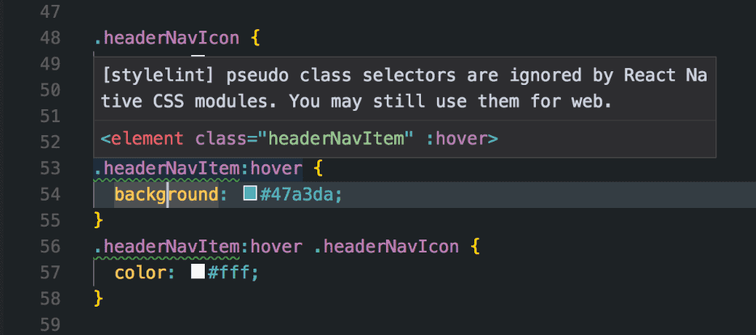

# stylelint-config-taro-rn



## Installation and usage

Install `stylelint-config-taro-rn` (and `stylelint` + `stylelint-taro-rn`, if you haven't done so yet):

```
yarn add stylelint stylelint-taro-rn stylelint-config-taro-rn --dev
```

or

```
npm install stylelint stylelint-taro-rn stylelint-config-taro-rn --save-dev
```

Create the `.stylelintrc` config file (or open the existing one) and extend `stylelint-config-taro-rn` config.

```json
{
  "extends": "stylelint-config-taro-rn",
  "rules": {
    "selector-class-pattern": "^[a-z][a-zA-Z0-9]*$"
  }
}
```

## Custom settings

The config enables by default warnings for at-rules, units, CSS selectors that are not compatible with React Native .

If you want to turn off the warnings, you can use the following config:

```json
{
  "extends": "stylelint-config-taro-rn",
  "rules": {
    "taro-rn/font-weight-no-ignored-values": null,
    "at-rule-blacklist": null,
    "unit-whitelist": null,
    "selector-pseudo-class-whitelist": null,
    "selector-max-universal": null,
    "selector-max-attribute": null,
    "selector-max-type": null,
    "selector-max-combinators": null,
    "selector-max-id": null
  }
}
```

If you want to change the at-rule, unit, and CSS selector warnings into stylelint errors (e.g. If you are using React Native only), you can use the following config:

```json
{
  "extends": "stylelint-config-taro-rn",
  "rules": {
    "at-rule-blacklist": [
      ["keyframes", "font-face", "supports", "charset"],
      {
        "severity": "error",
        "message": "the @-rule is ignored by React Native ."
      }
    ],
    "unit-whitelist": [
      ["px", "rem", "deg", "%", "vh", "vw", "vmin", "vmax"],
      {
        "severity": "error",
        "message": "the unit is ignored by React Native ."
      }
    ],
    "selector-pseudo-class-whitelist": [
      ["export", "root"],
      {
        "severity": "error",
        "message": "pseudo class selectors are ignored by React Native ."
      }
    ],
    "selector-max-universal": [
      0,
      {
        "severity": "error",
        "message": "universal selectors are ignored by React Native ."
      }
    ],
    "selector-max-attribute": [
      0,
      {
        "severity": "error",
        "message": "attribute selectors are ignored by React Native ."
      }
    ],
    "selector-max-type": [
      0,
      {
        "severity": "error",
        "message": "type selectors are ignored by React Native ."
      }
    ],
    "selector-max-combinators": [
      0,
      {
        "severity": "error",
        "message": "combinator selectors are ignored by React Native ."
      }
    ],
    "selector-max-id": [
      0,
      {
        "severity": "error",
        "message": "id selectors are ignored by React Native ."
      }
    ]
  }
}
```
