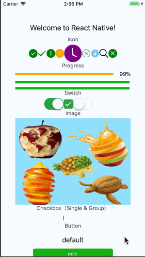

# Taro Components for React Native

Alo, alo! Bilibilibilibibili~

> IOS: Remember to link the libART.a into your project if you want to use Icon.

## Capture



## Example

Please use official AwesomeProject.

```bash
# RNComponent dependencies
npm i react-native-swiper react-dom
# Move source to example directory
cp -rf src AwesomeProjectDir/src/tcr
# import components
# import { Icon } from './tcr'
```

## About code comments

- ✔ Support
- ✘ Not support
- \- Would not support

## Todo list

> FS = Fully Support
> PS = Partially Support
> MS = Minimum Support

- 视图容器
  - [x] view | MS
  - [x] scroll-view | PS
  - [x] swiper | PS
- 基础内容
  - [x] icon | FS
  - [x] text | PS
  - [x] rich-text | FS
  - [x] progress | FS
- 表单内容
  - [x] button | PS
  - [x] checkbox | FS
  - [ ] form
  - [ ] input
  - [ ] label
  - [ ] picker | 
  - [x] radio | FS
  - [x] slider | PS
  - [x] switch | FS
  - [ ] textarea
- 导航
- 媒体组件
  - [ ] audio
  - [x] image | PS
  - [ ] video
  - [ ] camera
- 其他
  - [ ] tabbar

## pureDependencies

- react
- react-native

## D~

[flow type annotation for children react elements](https://stackoverflow.com/a/42887802)
