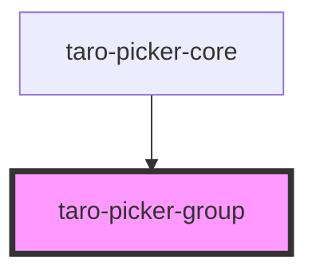

# taro-picker-group

<!-- Auto Generated Below -->

## Properties

| Property         | Attribute   | Description | Type                                                                            | Default     |
| ---------------- | ----------- | ----------- | ------------------------------------------------------------------------------- | ----------- |
| `columnId`       | `column-id` |             | `string`                                                                        | `undefined` |
| `height`         | `height`    |             | `number`                                                                        | `undefined` |
| `mode`           | `mode`      |             | `"date" \| "time"`                                                              | `undefined` |
| `onColumnChange` | --          |             | `(height: number, columnId: string) => void`                                    | `undefined` |
| `range`          | --          |             | `any[]`                                                                         | `[]`        |
| `rangeKey`       | `range-key` |             | `string`                                                                        | `undefined` |
| `updateDay`      | --          |             | `(value: number, fields: number) => void`                                       | `undefined` |
| `updateHeight`   | --          |             | `(height: number, columnId: string, needRevise?: boolean \| undefined) => void` | `undefined` |

## Dependencies

### Used by

 - [taro-picker-core](.)

### Graph

----------------------------------------------

*Built with [StencilJS](https://stenciljs.com/)*
