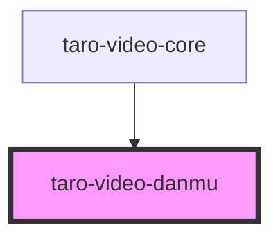

# taro-video-danmu

<!-- Auto Generated Below -->

## Properties

| Property | Attribute | Description | Type      | Default |
| -------- | --------- | ----------- | --------- | ------- |
| `enable` | `enable`  |             | `boolean` | `false` |

## Methods

### `sendDanmu(danmuList?: Partial<Danmu> | Partial<Danmu>[]) => Promise<void>`

#### Returns

Type: `Promise<void>`

### `tick(currentTime: number) => Promise<void>`

#### Returns

Type: `Promise<void>`

## Dependencies

### Used by

 - [taro-video-core](.)

### Graph

----------------------------------------------

*Built with [StencilJS](https://stenciljs.com/)*
